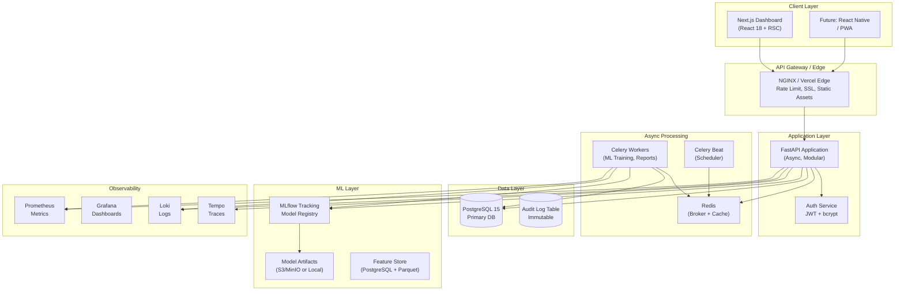
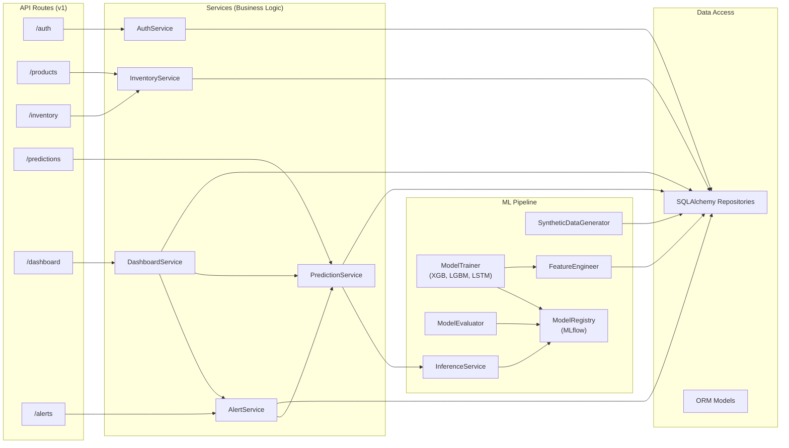
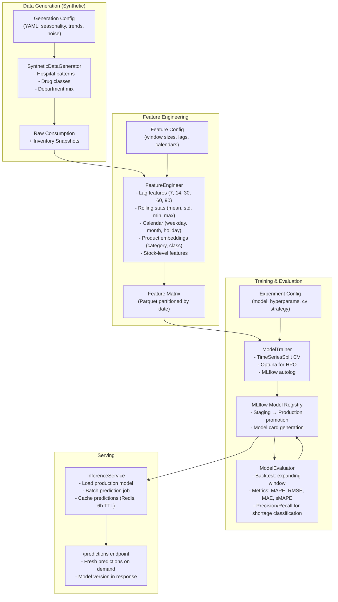
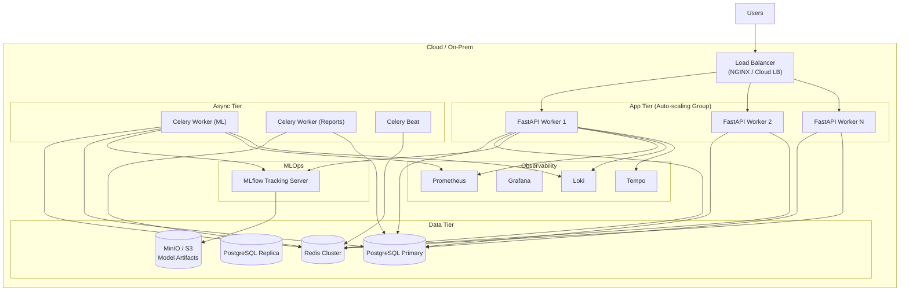
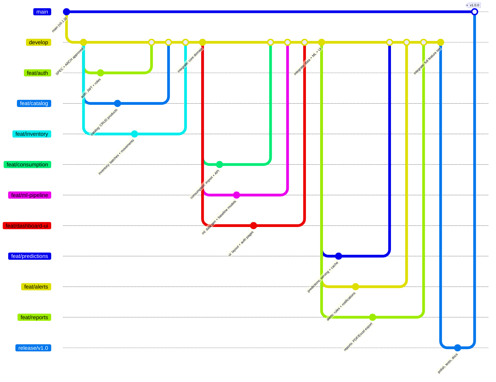

# Architecture: PharmaPredict

## High-Level Architecture Diagram



---

## Component Architecture (Backend)



---

## Data Model (Core Entities)

```mermaid
erDiagram
    USER ||--o{ ROLE : has
    PRODUCT ||--o{ INVENTORY_BATCH : has
    PRODUCT ||--o{ CONSUMPTION : generates
    PRODUCT ||--o{ PREDICTION : has
    PRODUCT ||--o{ ALERT : triggers
    INVENTORY_BATCH ||--o{ STOCK_MOVEMENT : tracks
    WAREHOUSE ||--o{ INVENTORY_BATCH : stores

    USER {
        uuid id PK
        string email UK
        string hashed_password
        string full_name
        boolean is_active
        datetime created_at
    }

    ROLE {
        uuid id PK
        string name UK  -- pharmacist, manager, admin
        string[] permissions
    }

    PRODUCT {
        uuid id PK
        string sku UK
        string name
        string generic_name
        string category  -- antibiotic, analgesic, etc.
        string unit  -- mg, ml, un
        decimal unit_cost
        integer min_stock_level
        integer max_stock_level
        integer lead_time_days
        boolean controlled_substance
        jsonb metadata  -- AT code, supplier info, etc.
        datetime created_at
    }

    INVENTORY_BATCH {
        uuid id PK
        uuid product_id FK
        uuid warehouse_id FK
        string batch_number
        integer quantity
        date expiry_date
        date manufacture_date
        decimal unit_cost
        string status  -- available, reserved, expired, recalled
        datetime received_at
    }

    STOCK_MOVEMENT {
        uuid id PK
        uuid batch_id FK
        uuid user_id FK
        integer quantity_change
        string movement_type  -- in, out, adjustment, transfer, loss
        string reference_type  -- prescription, purchase, transfer, adjustment
        uuid reference_id
        string notes
        datetime created_at
    }

    CONSUMPTION {
        uuid id PK
        uuid product_id FK
        date consumption_date
        integer quantity
        string department  -- ICU, ER, Ward, Outpatient
        string prescription_type  -- routine, emergency, prophylactic
        jsonb context  -- patient_count, seasonality_flags
    }

    PREDICTION {
        uuid id PK
        uuid product_id FK
        date forecast_date
        integer predicted_quantity
        integer confidence_lower
        integer confidence_upper
        string model_version
        float mape_score  -- backtest metric
        datetime created_at
    }

    ALERT {
        uuid id PK
        uuid product_id FK
        string alert_type  -- shortage_risk, expiry_risk, overstock
        string severity  -- info, warning, critical
        string message
        jsonb metadata  -- days_until_stockout, recommended_order_qty
        boolean acknowledged
        uuid acknowledged_by FK
        datetime acknowledged_at
        datetime created_at
    }

    WAREHOUSE {
        uuid id PK
        string name
        string location
        boolean is_primary
    }
```

---

## ML Pipeline Architecture



---

## Key ADRs (Architecture Decision Records)

### ADR-001: Monolithic FastAPI Backend over Microservices

**Status:** Accepted

**Context:** Team of 7, 10-week timeline, single hospital deployment. Need to maximize parallel work while minimizing operational complexity.

**Decision:** Build a **modular monolith** with clear internal boundaries (services, ML pipeline as separate package), deployed as a single container. Use internal module boundaries that could become service boundaries later.

**Alternatives Considered:**
- **Microservices (Auth, Inventory, ML, Dashboard as separate services)** — Adds network latency, distributed tracing complexity, deployment orchestration, inter-service auth. Overkill for single-tenant, 500 SKU scope.
- **Serverless (AWS Lambda/Vercel Functions)** — Cold starts hurt ML inference latency; vendor lock-in; harder local dev parity.

**Consequences:**
- Positive: Simple deployment, shared database transactions, easy refactoring, fast local dev
- Negative: Scaling requires full replica; ML training competes for resources (mitigated by Celery queue priority)
- Future: Extract `forecasting` and `ml-pipeline` as separate services when multi-tenant or GPU training needed

---

### ADR-002: PostgreSQL as Primary Datastore (No Separate Time-Series DB)

**Status:** Accepted

**Context:** Consumption data is time-series in nature. Need to store 3+ years of daily data for 500+ SKUs (~500k rows/year). Also need relational integrity for products, batches, users.

**Decision:** Use **PostgreSQL with native partitioning** for `consumption` and `prediction` tables. Leverage `timescaledb` extension if hypertable features needed, but start with native range partitioning.

**Alternatives Considered:**
- **TimescaleDB (separate instance)** — Adds operational complexity; native partitioning in PG 15+ covers 90% of needs
- **InfluxDB / ClickHouse** — Overkill; loses relational joins with product/master data
- **MongoDB** — Poor fit for structured time-series + relational catalog

**Consequences:**
- Positive: Single DB to operate, ACID across inventory + consumption, mature tooling, JSONB for flexible ML metadata
- Negative: Partition maintenance (automated via pg_partman), write throughput lower than columnar (acceptable at this scale)

**Implementation:**
```sql
-- Native range partitioning on consumption_date
CREATE TABLE consumption (
    id uuid NOT NULL DEFAULT gen_random_uuid(),
    product_id uuid NOT NULL REFERENCES product(id),
    consumption_date date NOT NULL,
    quantity integer NOT NULL,
    department varchar(50),
    prescription_type varchar(30),
    context jsonb,
    created_at timestamptz NOT NULL DEFAULT now()
) PARTITION BY RANGE (consumption_date);

-- Monthly partitions created automatically via pg_partman
```

---

### ADR-003: Synthetic Data Generation as First-Class Pipeline Component

**Status:** Accepted

**Context:** Hospital refuses to share real data. Academic project needs realistic data for ML training, testing, and demo. Synthetic data must capture: seasonality, drug-class patterns, department mix, stockout events, expiry dynamics.

**Decision:** Build a **configurable synthetic data generator** (`ml/generate_data.py`) as part of the codebase, not a one-off script. Parameterize via YAML so experiments are reproducible.

**Key Patterns to Model:**
| Pattern | Implementation |
|---------|----------------|
| **Seasonality** | Fourier terms + holiday calendar (Brazil ANVISA holidays) |
| **Drug class trends** | ARIMA-like base per ATC class + class-specific noise |
| **Department mix** | Dirichlet distribution over ICU/ER/Ward/Outpatient |
| **Stockout cascades** | Hawkes process: stockout → emergency orders → delayed replenishment |
| **Expiry-driven consumption** | FEFO (First Expired First Out) logic in movement simulation |
| **Supplier lead time variability** | Log-normal distribution per supplier |

**Consequences:**
- Positive: Reproducible experiments, version-controlled data gen, teaches data engineering skills
- Negative: Synthetic ≠ real; model may not generalize (mitigated by domain-informed parameters, literature review)

---

### ADR-004: ML Model Serving via In-Process Inference (Not Separate Model Server)

**Status:** Accepted

**Context:** 500 SKUs, 30-day horizon, daily batch predictions = 15,000 predictions/day. Latency requirement: < 100ms per prediction batch.

**Decision:** Load production model **in-process** in FastAPI workers (via `PredictionService` → `InferenceService`). Use Redis cache (6h TTL) for repeated requests. Retrain weekly via Celery Beat; hot-swap model version on promotion.

**Alternatives Considered:**
- **Triton / TorchServe / TensorFlow Serving** — Overhead of separate service, model versioning, health checks. Justified at > 100k predictions/day or multi-model.
- **ONNX Runtime / MLflow pyfunc** — Good alternatives; MLflow pyfunc chosen for registry integration.

**Consequences:**
- Positive: Zero network hop, simple deployment, shared Python env, easy A/B testing via model version parameter
- Negative: Model load time on worker restart (~2s for XGBoost, ~5s for LSTM); memory per worker (mitigated: gunicorn preload + shared memory)

---

### ADR-005: Next.js App Router with React Server Components for Dashboard

**Status:** Accepted

**Context:** Dashboard-heavy app with charts, tables, real-time data. Need SEO-friendly (not critical), fast initial load, progressive enhancement.

**Decision:** **Next.js 14+ App Router** with **Server Components by default**. Client Components only for: charts (Recharts), forms (React Hook Form), interactive filters, WebSocket connections (future).

**Data Fetching:** Server Components fetch directly from FastAPI (via internal network in prod, localhost in dev). Use `fetch` with `next: { revalidate: 30 }` for ISR on dashboard KPIs. `no-store` for real-time pages (alerts, inventory).

**Alternatives Considered:**
- **SPA (Vite + React Router)** — Slower initial load, no streaming, SEO harder (not needed but nice)
- **Remix** — Great but team knows Next.js; App Router is stable in 14+
- **TanStack Start** — Too new for 10-week project

**Consequences:**
- Positive: Streaming SSR for progressive dashboard loading, built-in caching, edge-ready, excellent TypeScript integration
- Negative: Learning curve for RSC patterns; hydration boundaries need care

---

### ADR-006: Celery + Redis for Async Tasks (Not Kafka/Cloud Functions)

**Status:** Accepted

**Context:** Need to run: weekly model retraining (5-30 min), daily prediction batch (1-2 min), on-demand report generation (10-60s), alert evaluation (every 15 min).

**Decision:** **Celery with Redis broker**. Single Redis instance for dev; Redis Cluster for prod if needed. Celery Beat for scheduling.

**Alternatives Considered:**
- **Kafka + Kafka Streams** — Overkill; no event sourcing requirement
- **Cloud Functions (AWS Lambda/GCP Cloud Run Jobs)** — Vendor lock-in; cold starts; harder local dev
- **Dramatiq / RQ** — Celery has better monitoring (Flower), Beat scheduler, maturity

**Consequences:**
- Positive: Familiar to Python teams, Flower for monitoring, priority queues for ML vs. reports, retry/backoff built-in
- Negative: Redis as SPOF (mitigated: Redis persistence + replica); worker scaling manual (acceptable)

---

### ADR-007: JWT Authentication with Short-Lived Access + Refresh Tokens

**Status:** Accepted

**Context:** Hospital environment; sessions should expire on browser close for security; but UX shouldn't require daily login.

**Decision:** **JWT access tokens (15 min) + HTTP-only secure refresh cookies (7 days)**. Rotate refresh tokens on use. Store refresh token hash in DB for revocation. Role-based permissions (pharmacist, manager, admin).

**Alternatives Considered:**
- **Session cookies only** — CSRF risk; harder to scale across domains
- **OAuth2/OIDC (Keycloak/Auth0)** — Overkill for MVP; document integration point

**Consequences:**
- Positive: Stateless API, secure, supports mobile/SPA, revocable
- Negative: Token refresh logic on frontend; clock skew handling

---

### ADR-008: Immutable Audit Log for All Inventory Mutations

**Status:** Accepted

**Context:** ANVISA/GMP compliance requires traceability of all stock movements. Who, what, when, why, previous state, new state.

**Decision:** **Append-only `audit_log` table** with triggers on `stock_movement`, `inventory_batch`, `product`. Never delete/update. Include: `actor_id`, `action`, `entity_type`, `entity_id`, `old_values`, `new_values`, `ip_address`, `user_agent`, `timestamp`.

**Implementation:**
```sql
CREATE TABLE audit_log (
    id bigserial PRIMARY KEY,
    actor_id uuid REFERENCES "user"(id),
    action varchar(50) NOT NULL,  -- CREATE, UPDATE, DELETE, DISPENSE, RECEIVE
    entity_type varchar(50) NOT NULL,
    entity_id uuid NOT NULL,
    old_values jsonb,
    new_values jsonb,
    ip_address inet,
    user_agent text,
    created_at timestamptz NOT NULL DEFAULT now()
);

CREATE INDEX idx_audit_entity ON audit_log (entity_type, entity_id, created_at DESC);
```

---

## Non-Functional Requirements (NFR Checklist)

| Category | Requirement | Target | Verification |
|----------|-------------|--------|--------------|
| **Performance** | Dashboard LCP | < 2.5s | Lighthouse CI |
| | API P95 (read) | < 200ms | Locust / k6 |
| | API P95 (write) | < 500ms | Locust / k6 |
| | Batch prediction (500 SKUs) | < 60s | MLflow benchmark |
| **Scalability** | Concurrent users | 50+ | k6 smoke test |
| | SKUs supported | 2,000+ | Load test |
| | Data retention | 5 years | Partition policy |
| **Availability** | Uptime (planned) | 99.5% | Monitoring |
| | RPO / RTO | 1h / 4h | Backup/restore test |
| **Security** | Encryption at rest | AES-256 | PG TDE / Volume encryption |
| | Encryption in transit | TLS 1.3 | SSL Labs A+ |
| | AuthZ model | RBAC + ABAC | Penetration test |
| | Audit logging | 100% mutations | Automated check |
| **Observability** | Metrics coverage | 100% endpoints | Prometheus rules |
| | Log structure | JSON + trace_id | Loki query test |
| | Distributed tracing | 100% requests | Tempo sampling |
| **Maintainability** | Cyclomatic complexity | < 10/function | CodeClimate / SonarQube |
| | Dependency freshness | < 30 days behind | Dependabot / Renovate |
| | Documentation coverage | Public API 100% | OpenAPI spec check |

---

## Deployment Architecture (Production)



---

## Development Workflow



---

## Risk Register & Mitigation

| Risk | Likelihood | Impact | Mitigation |
|------|------------|--------|------------|
| Synthetic data doesn't reflect real patterns | High | High | Literature review on hospital pharmacy consumption; parameterize heavily; validate with pharmacist SME |
| ML models fail to beat naive baseline | Medium | High | Start with strong baselines (seasonal naive, ETS); only advance if significant improvement; document negative results |
| Team coordination overhead (7 people) | High | Medium | Daily 15-min standups; clear module ownership; shared Notion/Linear board; pair programming for integration points |
| Scope creep (stakeholder requests) | High | Medium | Strict SPEC.md change control; "Ask First" boundary; demo-driven feedback every 2 weeks |
| ML training too slow for weekly retrain | Low | Medium | Profile early; use LightGBM (fast); cache features; parallelize CV folds |
| Database migrations conflict | Medium | High | Single migration author per sprint; review in PR; testcontainers in CI |
| Frontend/Backend contract drift | Medium | Medium | Generate TypeScript types from Pydantic (pydantic2ts); contract tests in CI |
| Key person dependency (ML expertise) | Medium | High | Pair on ML pipeline; document extensively; code review mandatory |

---

## Technology Decision Summary

| Decision | Choice | Rationale |
|----------|--------|-----------|
| **API Framework** | FastAPI | Async, type-safe, ML-friendly, OpenAPI |
| **Frontend** | Next.js 14 App Router | RSC, streaming, dashboard UX |
| **Database** | PostgreSQL 15 + partitioning | Relational + time-series, single ops |
| **ORM** | SQLAlchemy 2.0 async | Type-safe, mature, Alembic |
| **ML Primary** | LightGBM + XGBoost | Tabular forecasting SOTA, fast |
| **ML Advanced** | PyTorch LSTM/Transformer | Sequence modeling for complex patterns |
| **Experiment Tracking** | MLflow | Model registry, comparison, artifacts |
| **Async Tasks** | Celery + Redis | Mature, priority queues, Flower UI |
| **Auth** | JWT + Refresh Cookies | Secure, stateless, revocable |
| **Charts** | Recharts | React-native, accessible, declarative |
| **UI Kit** | shadcn/ui + Tailwind | Accessible, customizable, fast |
| **Testing** | pytest / Vitest / Playwright | Comprehensive pyramid |
| **CI/CD** | GitHub Actions | Integrated, free for public/private |
| **Containerization** | Docker + Compose | Dev/prod parity |
| **Observability** | Prometheus/Grafana/Loki/Tempo | Full stack, open source |

---

## Next Steps

1. **Approve SPEC.md** — Team lead + stakeholder sign-off
2. **Create module specs** — `SPEC-auth.md`, `SPEC-catalog.md`, etc. per capability map
3. **Initialize repos** — `backend/`, `frontend/` with tooling (uv, ruff, mypy, eslint, prettier)
4. **Set up CI** — GitHub Actions with lint, typecheck, test, build
5. **Sprint 1 (Week 1-2):** `auth` + `catalog` + project infrastructure
6. **Architecture review** — Mid-sprint (Week 3) to validate assumptions